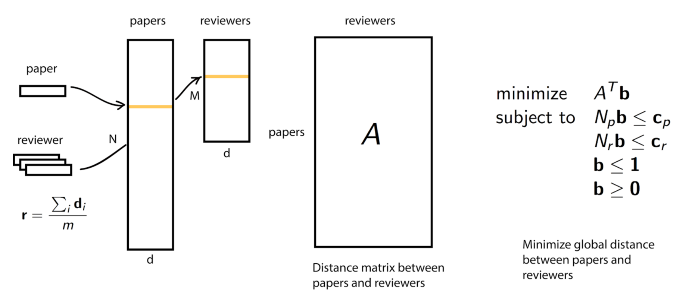

# Paper-Reviewer matcher

(work in progress)

Package for Paper-Reviewer matching which available at http://pr.scienceofscience.org/
(implementation based on this [article](http://www.cis.upenn.edu/~cjtaylor/PUBLICATIONS/pdfs/TaylorTR08.pdf)).
This package solves problem of assigning paper to reviewers with constrains by solving linear programming problem.
We minimize global distance between papers and reviewers in topic space (e.g. topic can be Principal component,
  Latent Semantic Analysis).

Here is a diagram of problem setup and how we solve the problem.





## Usage

I haven't put function together in one nice big function. However, here are
functions to solve paper-reviewer assignment problem

```python
from paper_reviewer_matcher import preprocess, affinity_computation,
                                   create_lp_matrix, linprog, create_assignment
papers = list(map(preprocess, papers)) # list of papers' abstract
reviewers = list(map(preprocess, reviewers)) # list of reviewers' abstract
A = affinity_computation(papers, reviewers)
# set conflict of interest by setting A[i, j] to -1000 or lower value
v, K, d = create_lp_matrix(A, min_reviewers_per_paper=0, max_reviewers_per_paper=0,
                              min_papers_per_reviewer=3, max_papers_per_reviewer=6)
x_sol = linprog(v, K.toarray(), d)['x'] # using scipy linprog for python 3
b = create_assignment(x_sol, A) # transform solution to assignment matrix
```


## Dependencies

- numpy
- scipy
- nltk
- scikit-learn
- [or-tools](https://github.com/google/or-tools) (linear programming solver for python 2.7)

please refer to [Stackoverflow](http://stackoverflow.com/questions/26593497/cant-install-or-tools-on-mac-10-10)
on how to install `or-tools` on MacOSX. I use `pip` to install `protobuf` before installing `or-tools`

```
$ pip install protobuf==3.0.0b4
$ pip install ortools
```

## Members

- Daniel Acuna (main author)
- Titipat Achakulvisut (re-write code)
- Tulakan Ruangrong
- Konrad Kording
