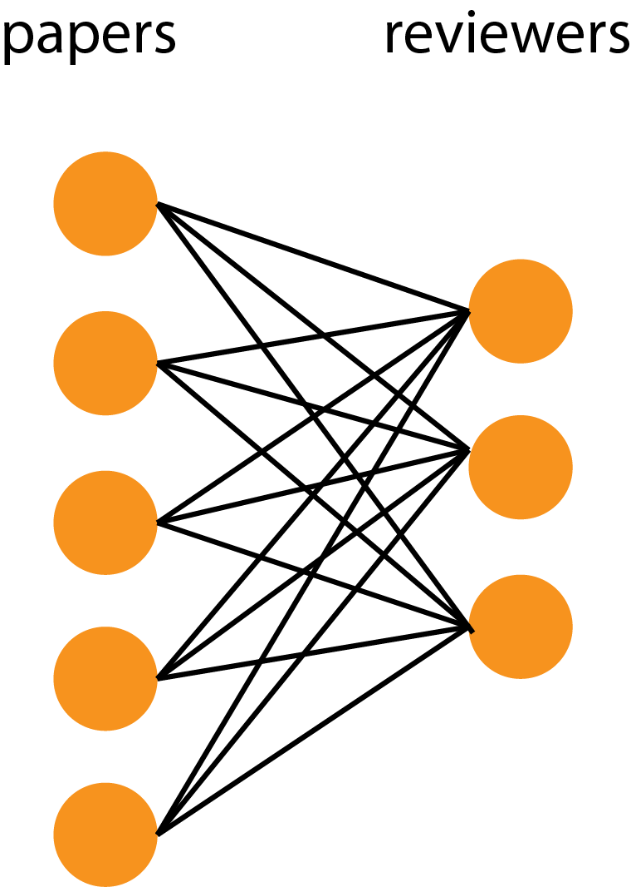

# Paper-Reviewer Matcher

A python package for paper-reviewer matching algorithm based on topic modeling and linear programming. The algorithm is implemented based on this [article](http://www.cis.upenn.edu/~cjtaylor/PUBLICATIONS/pdfs/TaylorTR08.pdf)). This package solves problem of assigning paper to reviewers with constrains by solving linear programming problem. We minimize global distance between papers and reviewers in topic space (e.g. topic modeling can be Principal component, Latent Semantic Analysis (LSA), etc.).

Here is a diagram of problem setup and how we solve the problem.



## Mind-Match Command Line

Mind-Match is a session we run at Cognitive Computational Neuroscience (CCN) conference.
We use a combination of topic modeling and linear programming to solve optimal matching problem.
To run example Mind-Match algorithm, you can clone the repository and run the following

```sh
python mindmatch.py data/mindmatch_example.csv --n_match=6 --n_trim=800
```

in the root of this repo. This should produce a matching output `output_match.csv` in this relative location.
Here, we have around 1,300 users and recommended to trim around 800. This takes 2-3 hours to run.

## Example script for the conferences

Here, I include a recent scripts for our Mind Matching session for CCN conference.

- `ccn_mind_matching_2019.py` contains script for Mind Matching session (match scientists to scientists) for [CCN conference](https://ccneuro.org/2018/)
- `ccn_paper_reviewer_matching.py` contains script for matching publications to reviewers for [CCN conference](https://ccneuro.org/2019/), see example of CSV files in `data` folder

The code makes the distance metric of topics between incoming papers with reviewers (for `ccn_paper_reviewer_matching.py`) and
between people with people (for `ccn_mind_matching_2019`). We trim the metric so that the problem is not too big to solve using `or-tools`.
It then solves linear programming problem to assign the best matches which minimize the global distance between papers to reviewers.
After that, we make the output that can be used by the organizers of the CCN conference -- pairs of paper and reviewers or mind-matching
schedule between people to people in the conference.
You can see of how it works below.


## Dependencies

Use `pip` to install dependencies

```sh
pip install -r requirements.txt
```

Please see [Stackoverflow](http://stackoverflow.com/questions/26593497/cant-install-or-tools-on-mac-10-10) if you have a problem installing `or-tools` on MacOS. You can use `pip` to install `protobuf` before installing `or-tools`

```sh
pip install protobuf==3.0.0b4
pip install ortools
```

for Python 3.6,

```sh
pip install --user --upgrade ortools
```

## Citations

If you use Paper-Reviewer Matcher in your work or conference, please cite us as follows

```
@misc{achakulvisut2018,
    author = {Achakulvisut, Titipat and Acuna, Daniel E. and Kording, Konrad},
    title = {Paper-Reviewer Matcher},
    year = {2018},
    publisher = {GitHub},
    journal = {GitHub repository},
    howpublished = {\url{https://github.com/titipata/paper-reviewer-matcher}},
    commit = {9d346ee008e2789d34034c2b330b6ba483537674}
}
```

## Members

- [Daniel Acuna](https://scienceofscience.org/) (original author)
- [Titipat Achakulvisut](https://github.com/titipata) (refactor)
- [Konrad Kording](http://kordinglab.com/)
